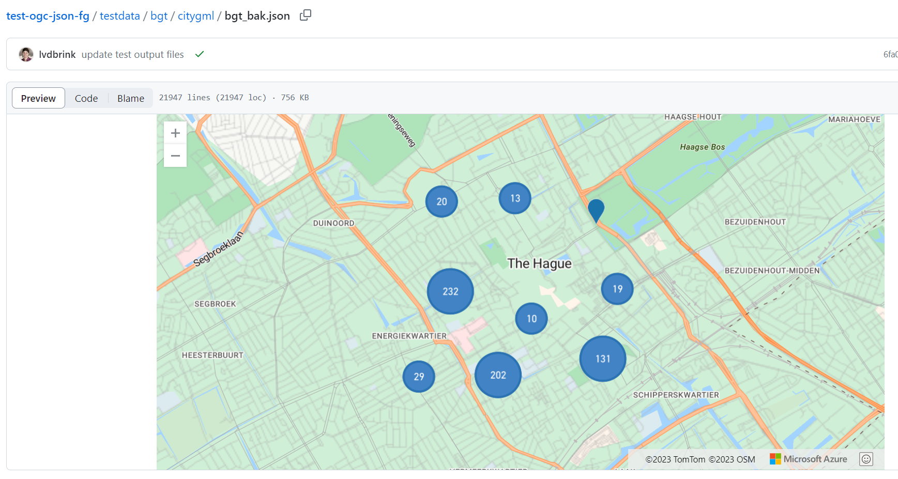
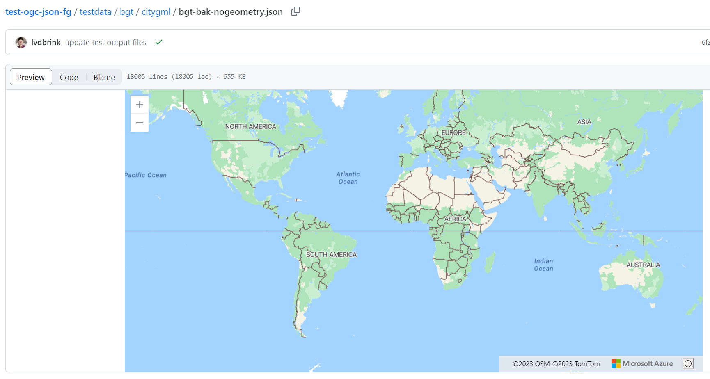
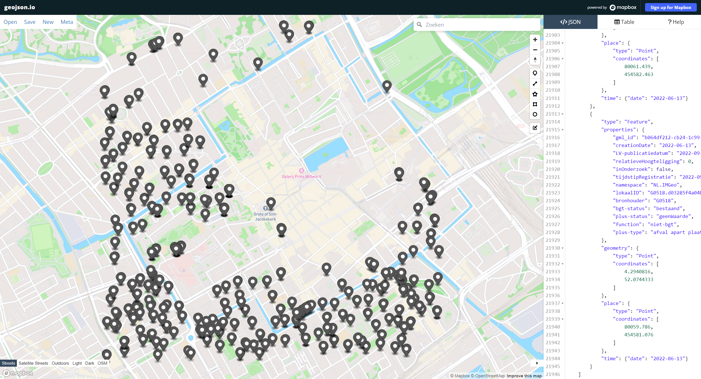

# Results
The complete list of tests and results is available in this [excel file][]. We tested most of the JSON-FG features, and found no issues in the GDAL implementation of it. 

## Geometry and place
The source data contained coordinates in the Dutch coordinate reference system RD. When converting to JSON-FG, by default GDAL: 
- fills the `place` member with the coordinates as found in the source;
- fills the `geometry` member with WGS84 coordinates. 

This conforms to the JSON-FG spec, but is not always what you want. Another option is to leave `geometry` empty (i.e. null value) and only fill the `place` member. You can instruct GDAL to do that, using the `WRITE_GEOMETRY=NO` option. 

When to fill `geometry`, and when to give it a null value: 
- When the JSON-FG is a payload of an API, this is clear from the response media type. The client probably asked specifically for JSON-FG, and therefore knows what it is and how to use it. In that case, it's unnecessary to enlarge the payload with `geometry` members containing converted coordinates. The client probably wants the specific CRS it asked for. If a client wants GeoJSON, with WGS84 coordinates, it can ask for that. 
- When publishing JSON-FG somewhere outside the context of a webservice/API, it does make sense to fill `geometry` as well as `place`. In that case, the user has no context that helps figure out what the file is. There is no mime type or anything like that. In that case, it is good practice to have the fallback geometry, so that the file can be used in GeoJSON clients as well as JSON-FG clients. 

## Time
The `time` member initially was filled with a `null` value by GDAL, because it could not identify the temporal information to use in the source data. There is no specific option in GDAL to point to the right source element. It looks for an element called `time`, `time_start`, or `time_end`. If that's not what it's called in your input, you need to do some remapping. You can do this e.g. with an SQL statement: 

`ogr2ogr out.json test.xml -of jsonfg -sql "select cast (creationDate as date) as time, * from BAK"`

In the example above, `creationDate` is the date element in the input we're interested in.

GDAL also writes the original property to `properties`, which is nice because the information is then not lost to GeoJSON clients (that only read `geometry` and `properties`). 

## featureType and schema
GDAL takes the featureType value from the element name in the case of GML, and from the column name in the case of GeoPackage. 

There is no option to have GDAL write the featureSchema with a URL pointing to a JSON Schema for a feature. We did create a JSON Schema by hand (for [BAK features](https://github.com/Geonovum/test-ogc-json-fg/blob/main/testdata/bgt/citygml/schema/bak.jschema)). For purposes of creating a comprehensive example file, we add this manually.

## 3D geometries

GDAL converts the 3D geometry types without problems. 

## Sample output
A sample file converted from IMGeo GML, containing trash bins the area of the Binnenhof, The Hague is [here](https://github.com/Geonovum/test-ogc-json-fg/blob/main/testdata/bgt/citygml/bgt_bak.json). This has both `place` and `geometry` with coordinate values, `time` element with date values, and only contains 2D point geometries. 

## Client tests

We tested the sample output in different clients. 

GeoJSON clients:
1. Github file preview. When `geometry` has coordinate values, this shows a map with point features. When `geometry` is null, it shows a world map without features. So this works as expected.

<figure>
    
    <figcaption>Github file preview, with coordinates in <code>geometry</code></figcaption>
</figure>

<figure>
    
    <figcaption>Github file preview, without coordinates in <code>geometry</code></figcaption>
</figure>

2. [geojson.io](https://geojson.io/) (mapbox). Result is the same as [1]. 

<figure>
    
    <figcaption>geojson.io viewer, with coordinates in <code>geometry</code></figcaption>
</figure>
<figure>
    
    <figcaption>geojson.io viewer, without coordinates in <code>geometry</code></figcaption>
</figure>

3. QGIS also works the same; it recognizes features in the file only if `geometry` has coordinates. It reads `properties` and ignores JSON-FG specific members.

JSON-FG clients: 
- A [JSON-FG client](https://ivansanchez.gitlab.io/gleo/demos/jsonfg-drag-drop.html) by Ivan Sanchez from an earlier code sprint is used to demonstrate that the JSON-FG output from GDAL can be visualised in a web browser. This works as expected. The client visualizes the features based on the values of the `place` member, regardless of the presence or absence of coordinates in the `geometry` member. Note that this client only supports 2D geometries, we did not do client tests with 3D geometries. 

<figure>
    
    <figcaption>JSON-FG client showing features based on coordinates in <code>place</code> member</figcaption>
</figure>