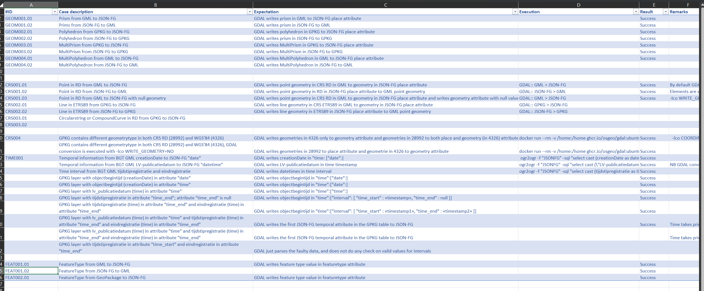

# Test scenarios

We collected our test cases and results in an [Excel spreadsheet](https://github.com/Geonovum-labs/test-ogc-json-fg/blob/main/testresults/testscenarios.xlsx).

<a href="https://github.com/Geonovum-labs/test-ogc-json-fg/blob/main/testresults/testscenarios.xlsx">
<figure>
    
    <figcaption>Test scenarios and results</figcaption>
</figure>
</a>

## What we tested

### JSON FG Spec requirements
-   Geometry:

    -   (Multi)Point, (Multi)Line, Multi(Polygon), GeometryCollection in *place*
        attribute

    -   (Multi)Polyhedron and (Multi)Prism in *place* attribute

-   CRS:

    -   Types:

        -   WGS'84 (in geometry and place attribute)

        -   RD: 28992

        -   ETRS89: 4258

        -   3857?

        -   900913?

-   Temporal:

    -   different source attributes to time instant + interval

-   Feature metadata

    -   Feature schema: JSON schema 
    -   Combine two datasets of BAG and BGT in 1 dataset?

### Formats

-   GML

    -   GeoJSON

        -   PostgreSQL

            -   OpenFileGeodatabase (ESRI)

            -   Esri Shapefile

        -   CRS:

            -   Syntax/Format:

                -   URI: "http://www.opengis.net/def/crs/EPSG/0/28992"

                1.  SAFE CURIE: "[EPSG: 3857]"

        -   Others:

            -   Arcs

            -   

### Test execution

-   Datasets:

    -   BGT GML (2D RD, and includes ARCs)

        -   BAG 3D Geopackage (Polyhedrons)

        -   BAG extruded polygons (Prims)

        -   Dutch administrative areas (temporal aspects)
